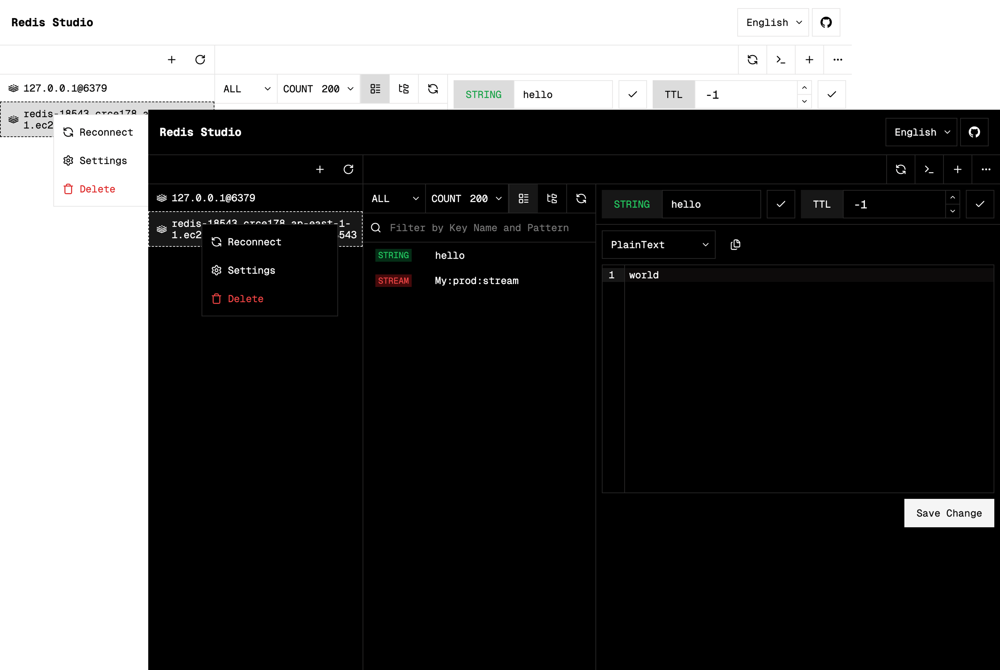

<div align="center" style="padding:32px;">
  
</div>

<div style='display:flex;align-items:center;justify-content:center;'>
  <a href="https://github.com/xuerzong/redis-studio/blob/main/LICENSE">
    
  </a>
  
  <a href="https://www.npmjs.com/package/@xuerzong/redis-studio">
    
  </a>

  <a href="https://www.npmjs.com/package/@xuerzong/redis-studio">
  
  </a>
</div>

🚀 **Redis Studio** 是一个轻量级（<2MB）、跨平台的 Redis GUI（图形用户界面）客户端。Redis Studio 旨在提供一种简单高效的方式来管理和监控您的 Redis 实例。

<p align='center'>
  
</p>

## ✨ 特性

- [x] **多连接支持:** 轻松管理和切换多个 Redis 实例。

- [x] **直观的 Key 浏览器:** 浏览、搜索、编辑和删除各种数据类型（String、List、Hash、Set、ZSet）。

- [x] **命令行控制台:** 内置一个强大的 Redis 命令行界面 (CLI)，允许您直接执行原生 Redis 命令。

- [x] **跨平台:** 支持 Windows、macOS 和 Linux。

## 🚀 开始使用

### 安装

> [!IMPORTANT]
> 在安装之前, 你需要安装 [Node.js 18+](https://https://nodejs.org/).

您可以通过 npm (Node Package Manager) 在全局安装 Redis Studio 命令行工具。

```bash
npm -g @xuerzong/redis-studio
```

### 启动服务

> [!NOTE]
> Redis Studio 作为独立应用程序运行，其服务器提供 Web 界面。您仍然需要一个正在运行的 Redis 实例才能连接并管理您的数据。

安装后，使用 `rds` 命令来管理 Redis Studio 的后台服务。

- 检查版本

<!-- end list -->

```bash
rds --version # 或者 `rds -V`
```

- 启动服务

<!-- end list -->

```bash
rds start
```

- 停止服务

<!-- end list -->

```bash
rds stop
```

- 重启服务

<!-- end list -->

```bash
rds restart
```

## 🔨 配置

### 默认设置

默认情况下，Redis Studio 服务在本地主机（localhost）的 `5090` 端口上运行。

### 自定义端口

您可以在启动服务时使用命令行标志来指定不同的端口：

```bash
rds start --port 9000
```

## 💻 如何开发

```bash
cd ./redis-studio

npm install

npm run start
```
